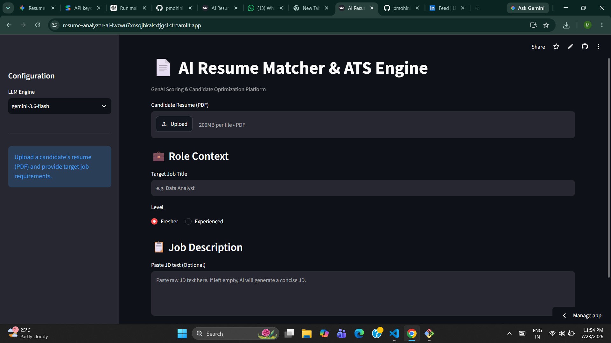
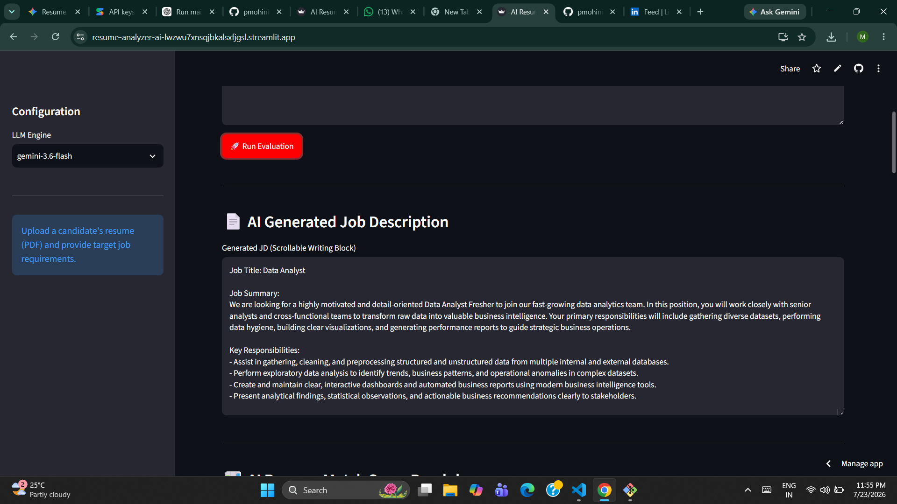
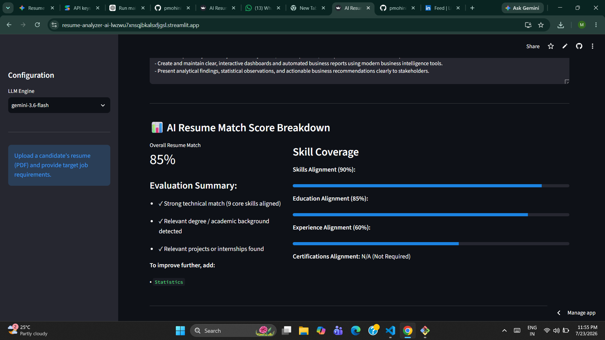
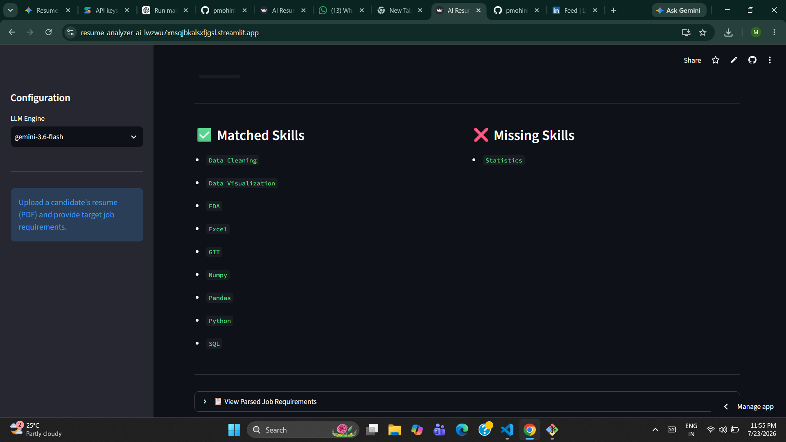
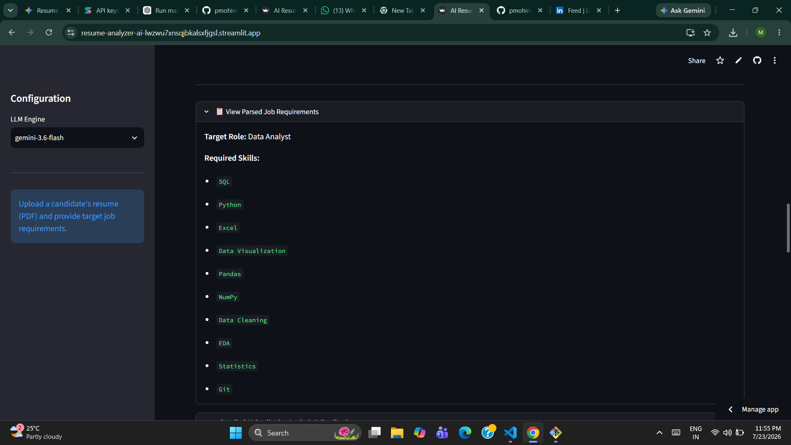
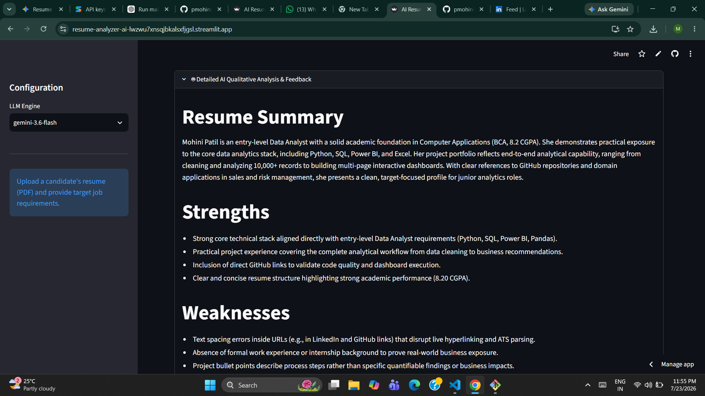
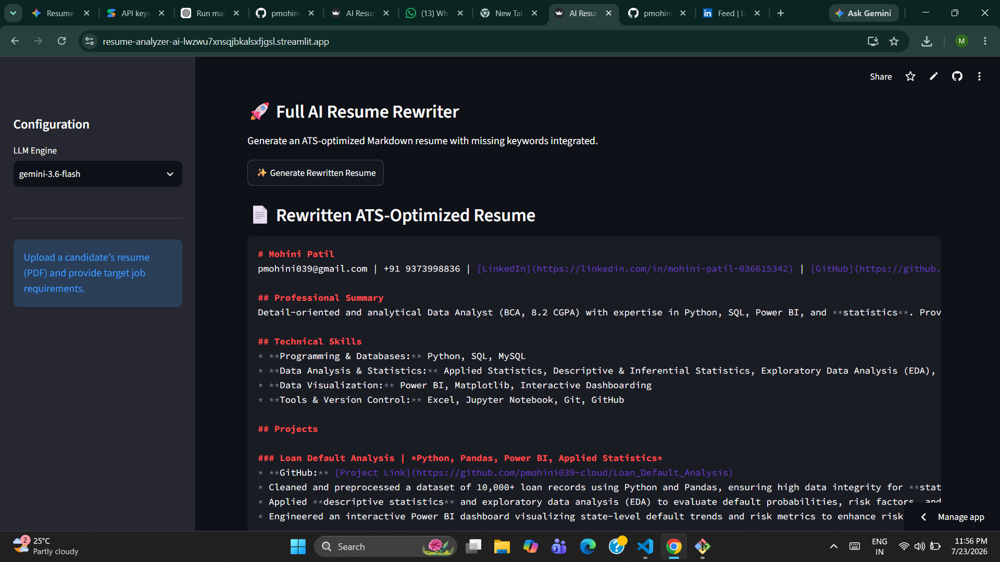
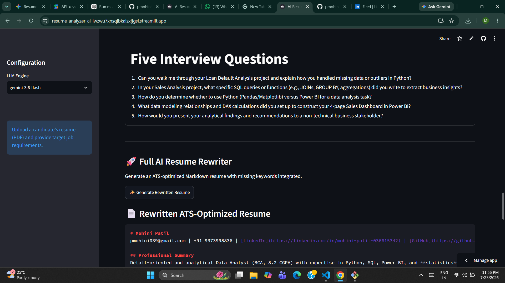

# 📄 AI Resume Matcher & ATS Engine

An AI-powered Resume Matcher & ATS Engine built with **Python**, **Streamlit**, and **Google Gemini AI**. The application analyzes resumes against a target job description, calculates ATS compatibility, identifies skill gaps, provides AI-powered feedback, rewrites resumes for better ATS performance, and generates personalized interview questions.

---

## 🚀 Live Demo

🔗 https://resume-analyzer-ai-lwzwu7xnsqjbkalsxfjgsl.streamlit.app/

---

## ✨ Features

- 📄 Upload resumes in PDF format
- 🤖 AI-generated Job Description
- 📊 ATS Resume Match Score
- ✅ Skill Matching & Gap Analysis
- 🔍 Missing Skill Detection
- 💡 AI-powered Resume Review
- ✍️ ATS-Optimized Resume Rewriter
- 🎯 Personalized Technical Interview Questions
- 📥 Candidate Evaluation Report

---

## 🛠️ Tech Stack

### Programming Language

- Python

### Framework

- Streamlit

### AI Models

- Google Gemini API
- Ollama (Local LLM Support)

### Libraries

- Pandas
- NumPy
- PDFPlumber
- PyPDF2

### Version Control

- Git & GitHub

---

## 📂 Project Structure

```text
resume-analyzer-ai/
│
├── app.py
├── analyzer.py
├── comparison.py
├── jd_analyzer.py
├── job_generator.py
├── pdf_reader.py
├── prompts.py
├── resume_optimizer.py
├── semantic_matcher.py
├── requirements.txt
├── screenshots/
└── README.md
```

---

## ⚙️ Installation

### Clone the repository

```bash
git clone https://github.com/pmohini039-cloud/resume-analyzer-ai.git
```

### Go to the project directory

```bash
cd resume-analyzer-ai
```

### Install dependencies

```bash
pip install -r requirements.txt
```

### Configure Gemini API

Create a `.streamlit/secrets.toml` file and add:

```toml
GEMINI_API_KEY="YOUR_API_KEY"
```

### Run the application

```bash
streamlit run app.py
```

---

# 📸 Application Screenshots

## 🏠 Home Page



---

## 🤖 AI Generated Job Description



---

## 📊 ATS Resume Match Score



---

## ✅ Skill Match & Missing Skills



---

## 📋 Parsed Job Requirements



---

## 💡 AI Resume Analysis & Feedback



---

## 🚀 ATS Resume Rewriter



---

## 🎯 Personalized Interview Questions



---

## 🔮 Future Improvements

- DOCX Resume Support
- Multiple Resume Comparison
- PDF Report Export
- Resume History Dashboard
- User Authentication
- Cloud Database Integration
- Enhanced ATS Scoring

---

## 👩‍💻 Author

**Mohini Patil**

📧 Email: pmohini039@gmail.com

🔗 GitHub: https://github.com/pmohini039-cloud

🔗 LinkedIn: https://www.linkedin.com/in/mohini-patil-036615342

---

⭐ If you found this project useful, consider giving it a **Star** on GitHub!
